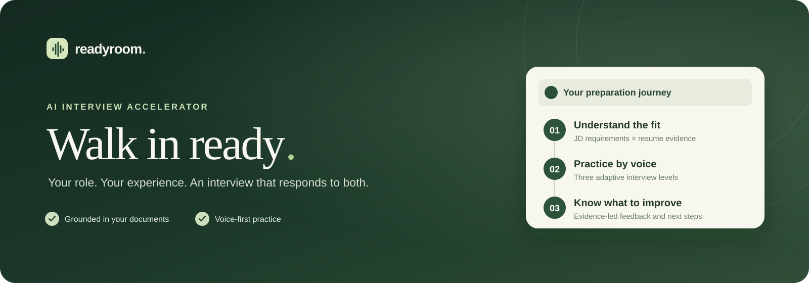
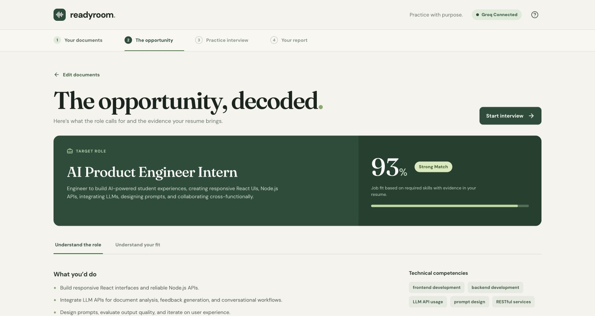
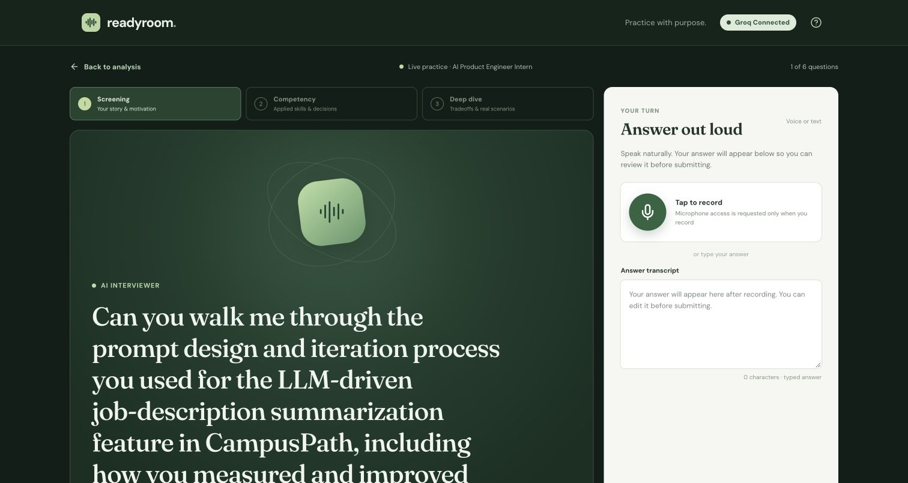
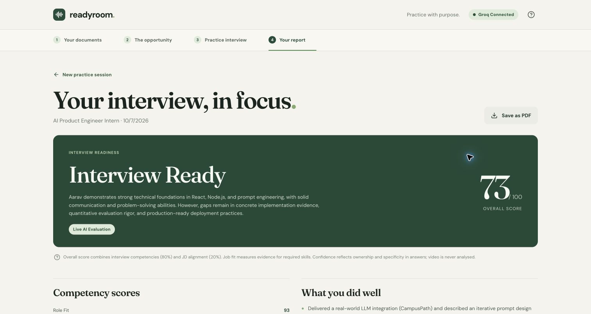
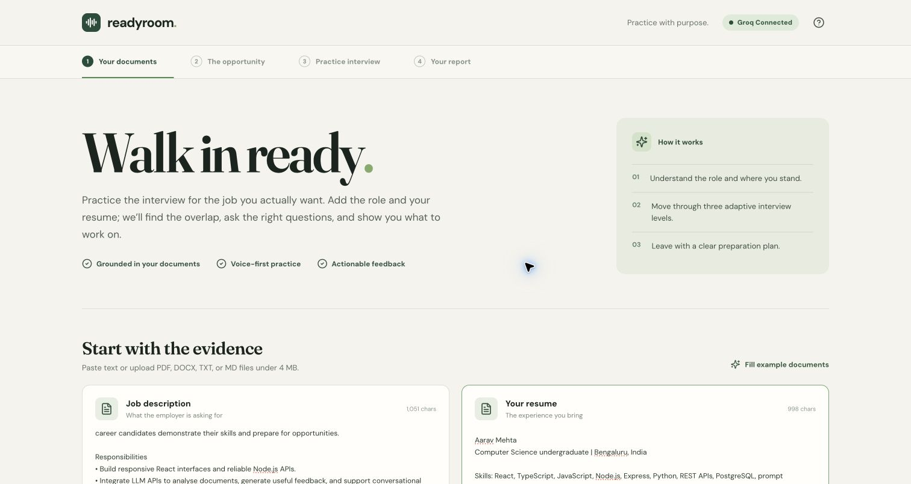
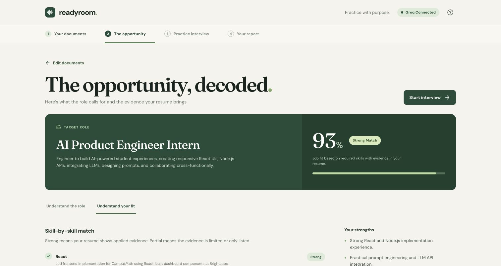
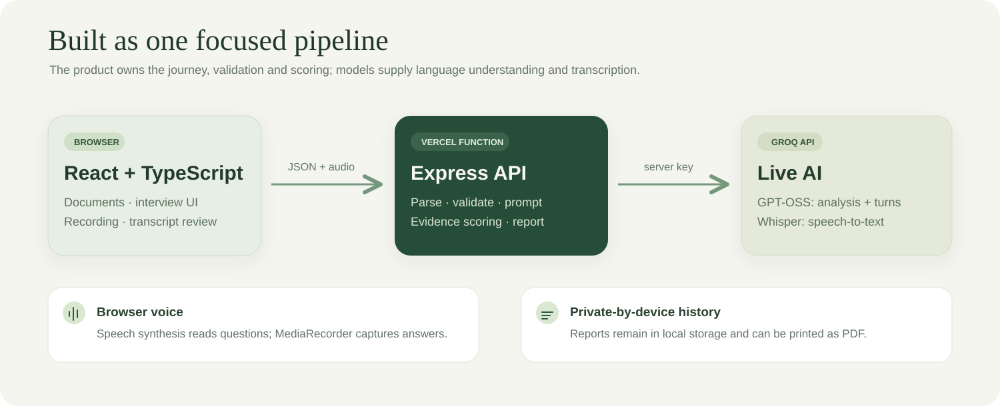

# Readyroom

<p align="center">
  
</p>

<p align="center">
  <strong>A personal interview room for the job you actually want.</strong><br />
  Readyroom reads a job description and resume, runs an adaptive interview, then turns each answer into a practical preparation plan.
</p>

<p align="center">
  <a href="https://vibes-tawny.vercel.app"><strong>Open the live app ↗</strong></a>
  &nbsp;·&nbsp;
  <a href="#see-the-product">See the product</a>
  &nbsp;·&nbsp;
  <a href="#run-it-locally">Run it locally</a>
</p>

> [!NOTE]
> The prefilled job description and resume are fictional examples. They make the journey easy to try; the analysis, interview questions, feedback, and report are generated by live Groq requests.

## One journey, three outcomes

| 01 · Understand | 02 · Practise | 03 · Improve |
| :--- | :--- | :--- |
| See what the role requires and where your resume has evidence. | Answer six questions that react to what you said. | Leave with scores, answer-level feedback, and a ranked study plan. |
| **Role analysis + job fit** | **Voice or text interview** | **Readiness report** |

## See the product

### 01 / Find the real requirements

Readyroom separates required skills, preferred skills, responsibilities, and candidate evidence. Job fit shows the evidence behind each required-skill match.

[](assets/readme/02-role-analysis.jpg)

### 02 / Make the interview respond to you

The interview moves through **screening → competency → deep dive**. After every answer, the server evaluates it and asks the next question using the role, resume, and conversation so far. Speak, review the transcript, and submit—or type an answer.

[](assets/readme/04-interview.jpg)

### 03 / Know exactly what to prepare

The final report brings together overall readiness, seven competency scores, strengths, improvement areas, question-level feedback, and three ranked preparation gaps. You can save it as a PDF with the browser print flow.

[](assets/readme/05-report.jpg)

<details>
<summary><strong>More screens:</strong> document setup and skill-by-skill candidate fit</summary>

<br />

The document step accepts pasted text or PDF, DOCX, TXT, and MD uploads. The example documents are available with one click.

[](assets/readme/01-documents.jpg)

The candidate view shows the evidence for each skill, relevant work, strengths, and claims an interviewer may probe.

[](assets/readme/03-candidate-fit.jpg)

</details>

## How it works

<p align="center">
  
</p>

| Stage | What happens | Where to look |
| :--- | :--- | :--- |
| **Documents** | Extract text from uploads and validate input before analysis. | [`server/app.ts`](server/app.ts) |
| **Understanding** | Ask Groq for separate JD and resume analyses, then classify evidence for each required skill. | [`server/ai.ts`](server/ai.ts), [`server/engine.ts`](server/engine.ts) |
| **Interview** | Generate one question at a time. Each turn includes prior answers, feedback, skill gaps, and the latest answer. | [`server/ai.ts`](server/ai.ts) |
| **Voice** | Browser `MediaRecorder` captures audio; Groq Whisper transcribes it. Browser `speechSynthesis` reads questions. | [`src/App.tsx`](src/App.tsx), [`server/ai.ts`](server/ai.ts) |
| **Report** | Calibrate model competency ratings against answer scores, calculate readiness, and show evidence and preparation gaps. | [`server/engine.ts`](server/engine.ts), [`src/App.tsx`](src/App.tsx) |

The frontend is **React + TypeScript + Vite**. An **Express API** handles parsing and Groq calls; [`api/index.ts`](api/index.ts) exposes it as a Vercel Function. Shared typed contracts keep client and server in sync. Groq uses `openai/gpt-oss-120b` for structured chat responses and `whisper-large-v3-turbo` for transcription. The API key stays on the server in a Vercel environment variable.

### Why the questions change

The six-turn structure stays predictable for a short session: **two questions per level**. The question text does not come from a fixed list. The next prompt sees the latest response, earlier questions and answers, scored weaknesses, role requirements, and resume evidence. It asks for clarification after a weak answer or a harder tradeoff, metric, failure mode, or scenario after a strong one. Prompt instructions distinguish hypothetical plans from work the candidate actually completed.

### What the numbers mean

| Measure | Method |
| :--- | :--- |
| **Job fit** | Each required skill gets **1** for applied resume evidence, **0.5** for partial or skills-list evidence, or **0** when missing. The average becomes the fit percentage. |
| **Question score** | Relevance **25**, technical accuracy **25**, depth **20**, specificity and evidence **20**, clarity **10**. |
| **Competencies** | Six interview competency ratings blend **35%** model rating with **65%** average question score. **Role Fit** uses the calculated job fit. |
| **Overall score** | **80%** interview competency average + **20%** job fit. |
| **Readiness** | Below **50**: Not Ready · **50–69**: Needs Preparation · **70–84**: Interview Ready · **85+** with fit at least **75**: Strong Candidate. |

These are coaching signals, not a hiring prediction. “Confidence” measures specificity and ownership in answers; the app does not analyse facial expression or emotion. Speaking pace is shown only for recorded voice answers, while filler and STAR cues are approximate transcript signals.

## Run it locally

Requires **Node.js 20.16+** and a [Groq API key](https://console.groq.com/keys).

```bash
npm install
cp .env.example .env
# Add GROQ_API_KEY to .env
npm run dev
```

Open **http://localhost:5173**. Vite proxies `/api` to the local Express server.

```bash
npm test
npm run build
```

For the public deployment, Vercel builds the Vite frontend and serves the Express API through `/api/index`. GitHub pushes to `main` trigger deployment. Set `GROQ_API_KEY` in the Vercel project’s Production and Preview environment variables so visitors can start immediately. Never put a key in Git or a `VITE_` variable.

## Prototype boundaries

- Documents and answers are sent to Groq for live analysis. The server has no interview database or recording store. Up to eight completed reports stay in this browser’s local storage.
- The optional camera is a local preview and is never scored or sent for AI analysis. Voice recording needs HTTPS or localhost; typing remains available.
- PDFs need embedded text; scanned images are not OCR’d. Uploads and recordings are limited to **4 MB**.
- The app is part of [StudentCredibility’s Interview Accelerator challenge](https://studentcredibility.com), focused on helping early-career candidates demonstrate evidence of their skills.
