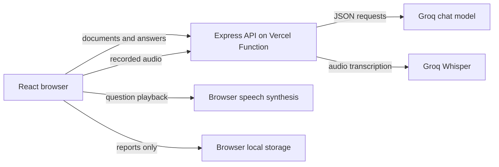

# Readyroom

Readyroom is a live AI interview accelerator for a specific job application. It reads a job description and resume, explains the candidate's fit, conducts a voice-capable three-level interview, and produces evidence-based feedback and a preparation plan.

It focuses on interview preparation within [StudentCredibility's](https://studentcredibility.com) broader challenge of helping early-career candidates demonstrate convincing evidence of their skills.

**[Open the live app](https://vibes-tawny.vercel.app)** · [Assignment coverage and limits](./ASSIGNMENT_REVIEW.md) · [Applicant recording script](./RECORDING_SCRIPT.md)

The example documents in the UI are fictional demo material. They prefill the form only; all analysis, questions, evaluations, and report text still call Groq live.

## Run locally

Requires Node.js 20.16+ and a [Groq API key](https://console.groq.com/keys).

```bash
npm install
cp .env.example .env
# Set GROQ_API_KEY in .env
npm run dev
```

Open `http://localhost:5173`. The React frontend runs on Vite and proxies `/api` to the local Node server. You can leave `GROQ_API_KEY` blank and enter a key in the app's settings for the current browser tab. For a public demo, set the key on the server so visitors can use the app immediately.

```bash
npm test
npm run build
```

## User journey

1. Paste or upload a JD and resume (PDF, DOCX, TXT, or MD; files under 4 MB).
2. Inspect the role analysis, candidate evidence, required-skill match, and job fit score.
3. Complete six adaptive questions: two screening, two competency, and two deep-dive.
4. Answer by voice or type. For voice, record, transcribe, review, then submit.
5. Review the overall score, seven competency scores, question feedback, strengths, weaknesses, preparation plan, and readiness assessment. Save the report using the browser's PDF print flow.

The optional camera is a local preview. It is never sent to an AI model or used for scoring. Speaking pace is calculated only for recorded voice answers of at least three seconds; filler and STAR indicators are approximate transcript/writing cues and do not determine the main score.

## Architecture



- `src/`: responsive React interface, microphone and camera controls, report and local history.
- `api/index.ts`: Vercel Function entry.
- `server/app.ts`: file parsing and request validation.
- `server/ai.ts`: Groq prompts and transcription.
- `server/engine.ts`: interview level progression, evidence-based fit calculation, score normalization, and readiness thresholds.
- `shared/`: typed contracts and fictional example documents.

The server uses `openai/gpt-oss-120b` for chat JSON responses and `whisper-large-v3-turbo` for speech-to-text. The model can be changed with `GROQ_MODEL` if the Groq account allows another compatible JSON-capable model. The browser's `speechSynthesis` speaks interviewer questions, avoiding another paid TTS dependency.

## Adaptive questioning

The first screening question refers to the candidate's actual work. For each answer, the API sends the JD analysis, resume analysis, skill gaps, previous questions and answers, prior weaknesses, the current question, and the latest answer to Groq. The next question is generated **after** evaluating the latest answer. The prompt asks for a precise clarification when the answer is weak, or a tougher tradeoff, metric, failure mode, or scenario when it is strong. Level progression is fixed at two questions per level to make the complete interview practical for a short demo; wording and follow-ups are not predetermined.

Document text and candidate answers are treated as untrusted data in the model instructions. The UI never displays a fabricated score when the live request fails: it shows an error and keeps the candidate's work available for retry.

## Evaluation methodology

- Each answer receives a 0–100 score for relevance (25), accuracy (25), depth (20), specificity and evidence (20), and clarity (10), plus concrete strengths, improvements, and an ideal direction.
- Job fit is computed from the required JD skills. Applied evidence in the resume counts as **1**, limited or skills-list-only evidence as **0.5**, and no evidence as **0**. The score is the weighted average across required skills. It is an evidence score, not a hiring probability.
- The report model rates Technical Knowledge, Problem Solving, Communication, Confidence, Depth of Understanding, and Behavioural Fit. Each rating is calibrated against the average question score (35% model rating, 65% question evidence) so an upbeat summary cannot outweigh weak answers. Role Fit is the calculated job fit score. Overall score is **80%** the average of the six interview competencies and **20%** job fit.
- Readiness: below 50 = Not Ready; 50–69 = Needs Preparation; 70–84 = Interview Ready; 85+ with job fit at least 75 = Strong Candidate. These are coaching thresholds, not claims about a real employer's decision.
- “Confidence” means specificity and ownership in answers. Facial expression and emotion are not analysed.

## Deploy to Vercel

The repository is configured as a Vite project with one API function at `/api/index`.

1. Connect this GitHub repository in the existing Vercel project's **Settings → Git**. The project is already configured; subsequent pushes to `main` should deploy automatically.
2. Add `GROQ_API_KEY` as a Vercel environment variable for Production and Preview.
3. Push to `main`, wait for the Vercel Git deployment to finish, and check that the top-right status reads **Groq connected**.
4. Open the production URL in a private window. Deployment protection must allow evaluators to enter without a Vercel login.
5. Run a real interview with the fictional example documents before recording the demo.

The day-to-day release commands are `npm test`, `npm run build`, `git add -A`, `git commit -m "Describe change"`, and `git push origin main`. The push triggers Vercel when the Git integration is connected. Do not put the key in a commit or a frontend `VITE_` variable.

The key is never embedded in the frontend bundle. If no server key is configured, a candidate may enter a key in Settings; it remains only in the current tab's memory. Production should use the Vercel environment variable so evaluators do not need setup.

## Privacy and prototype limits

Documents and answers are sent to Groq for analysis and evaluation. The server keeps no database or interview recordings. Completed reports are saved in the user's browser local storage; clearing browser storage removes them. There is no account or cross-device sync. PDF upload reads embedded text and does not OCR scanned images; for those, paste the extracted text. Files and recordings must stay under 4 MB to fit the Vercel Function request limit. Microphone recording works on HTTPS or localhost in a modern browser; typed answers remain available if microphone permission is denied.

## Demo recording

Follow the [complete recording script and shot list](./RECORDING_SCRIPT.md) to make the final submission video. It covers every required screen, a real microphone response, adaptive questioning, the report, the code tour, and accurate explanations of scoring and bonus features.

The [assignment review](./ASSIGNMENT_REVIEW.md) maps each requirement and bonus to its actual implementation, including limits that should be described accurately in the demo.

An earlier [synthetic reference capture](./demo/README.md) is available for internal rehearsal. It is not the applicant's final recording. Add the link to your own completed video here before submitting.
